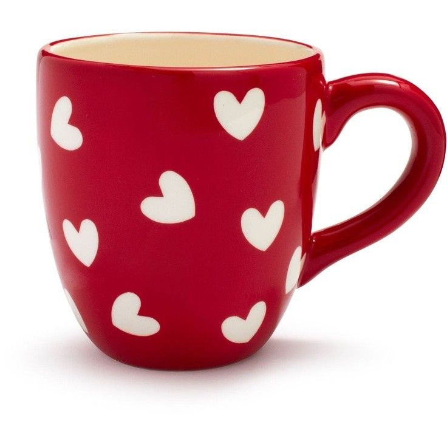
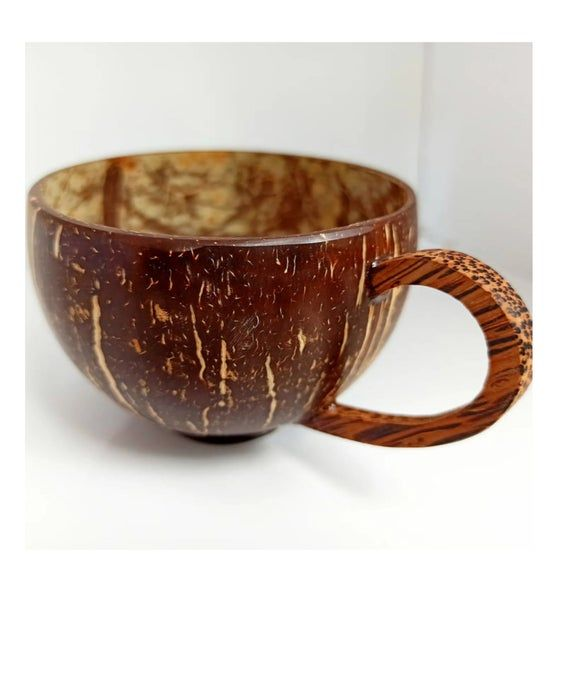
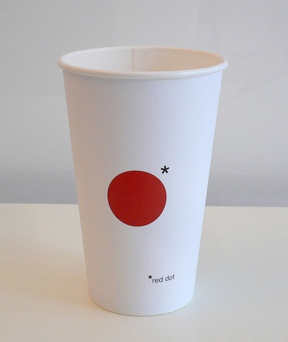
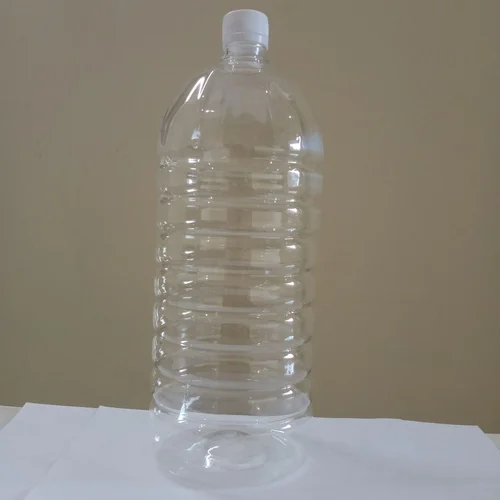
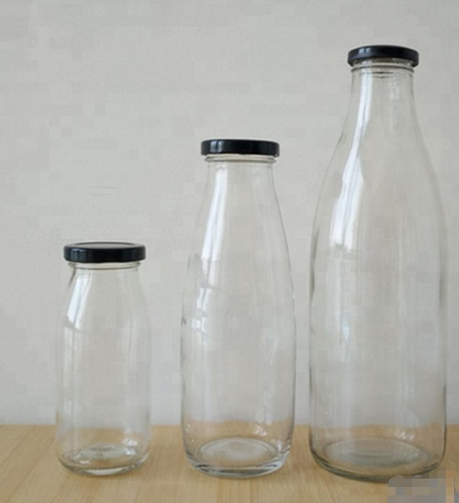
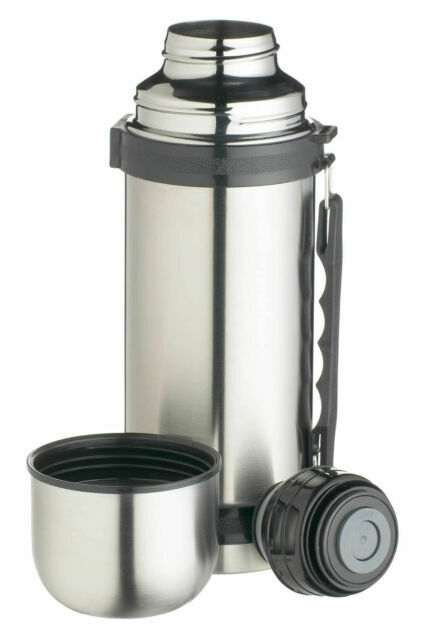
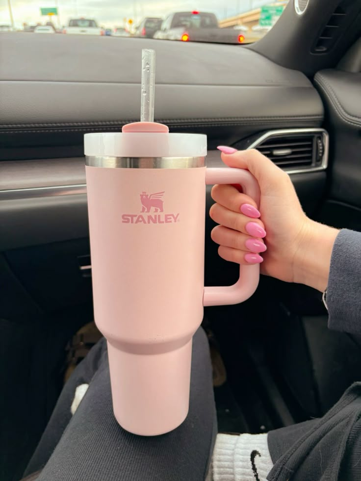
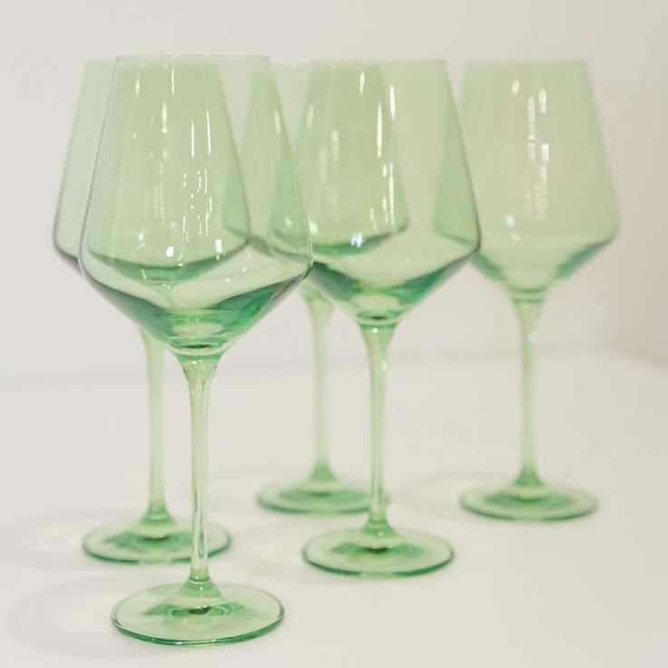

# Hi there 👋 I'm Roselle!

I'm a passionate developer who enjoys building clean and engaging applications for **web and mobile**.  
I love learning new technologies and improving my development skills every day through hands-on projects.

---

## 🚀 Featured Project  
# 🥤 Container Beverages Classification App

This project is a **Flutter-based mobile application** that identifies different **beverage containers** using **image classification**.  
It was developed as part of our **IT108 Final Project**, integrating **Teachable Machine** and **TensorFlow Lite**.

Users can **scan containers using the camera** or **upload images from the gallery** to automatically classify the container type.

---

## 🎯 Project Objectives
- 📸 Identify beverage containers using images  
- 🧠 Apply machine learning for accurate classification  
- 📊 Display analytics and scan history  
- 📱 Provide a clean and user-friendly mobile interface  

---

## 🥤 Beverage Container Classes

> 📁 Image source: `Container_Beverages_Class_Images/`

<table align="center">
<tr>
<td align="center">
 
<b>Mug</b> 
A cup with a handle commonly used for hot beverages.
</td>

<td align="center">
 
<b>Coconut Shell Cup</b> 
An eco-friendly cup made from coconut shells.
</td>

<td align="center">
 
<b>Paper Cup</b> 
A disposable cup for takeaway drinks.
</td>
</tr>

<tr>
<td align="center">
 
<b>Aluminum Can</b> 
A lightweight metal container for beverages.
</td>

<td align="center">
 
<b>Plastic Bottle</b> 
A common container for water and soft drinks.
</td>

<td align="center">
 
<b>Glass Bottle</b> 
A transparent bottle used for various drinks.
</td>
</tr>

<tr>
<td align="center">
 
<b>Thermos Flask</b> 
An insulated container that keeps drinks hot or cold.
</td>

<td align="center">
 
<b>Tumbler</b> 
A reusable cup for hot or cold beverages.
</td>

<td align="center">
 
<b>Wine Glass</b> 
A stemmed glass designed for wine.
</td>
</tr>

<tr>
<td align="center">
 
<b>Water Jug</b> 
A large container used for storing and pouring water.
</td>
</tr>
</table>

---

## 📱 Application Features (with Screenshots)

> 📁 Image source: `Application_Screenshot/`

<table align="center">
<tr>
<td align="center">
 
<b>Home Screen</b> 
Main dashboard for navigating the app.
</td>

<td align="center">
 
<b>Camera Scan</b> 
Scan beverage containers using the camera.
</td>
</tr>

<tr>
<td align="center">
 
<b>Analytics</b> 
Graphical summary of classified containers.
</td>

<td align="center">
 
<b>Scan History</b> 
View previously scanned containers.
</td>
</tr>
</table>

---

## 🧠 Technologies Used

### Mobile Development
- Flutter  
- Dart  

### Machine Learning
- Teachable Machine  
- TensorFlow Lite (`.tflite`)  
- `labels.txt`  

### Tools
- Git & GitHub  
- Android Emulator / Physical Device  

---

## 🗂️ Project Structure

---

## 📫 How to Reach Me
📧 **Email:** rosellepazo19@gmail.com  

---

## ✨ Fun Fact
I enjoy exploring new technologies and transforming ideas into real-world applications!

---

## 📊 GitHub Stats

