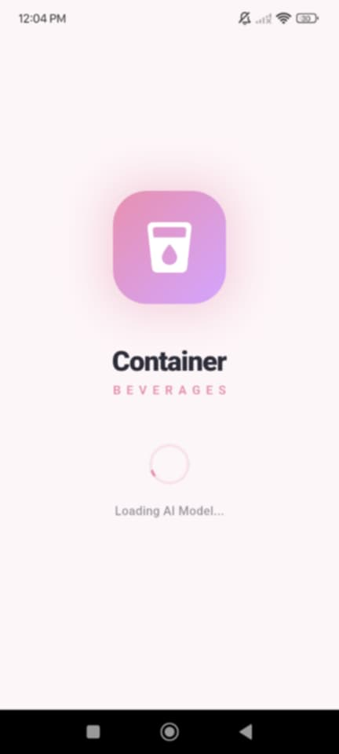
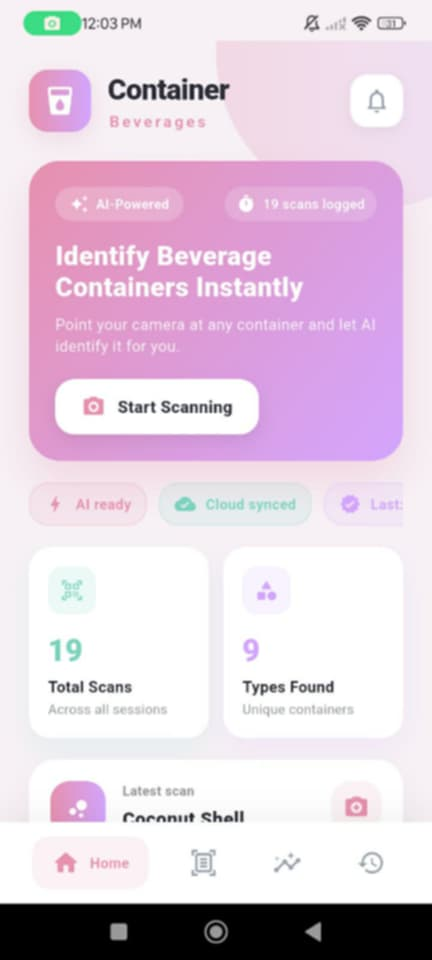
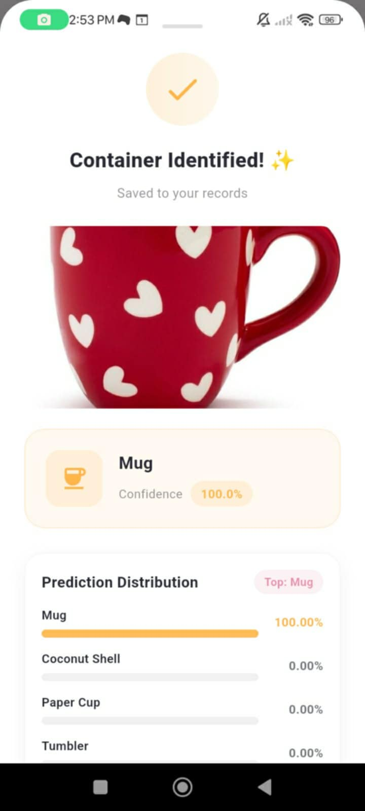
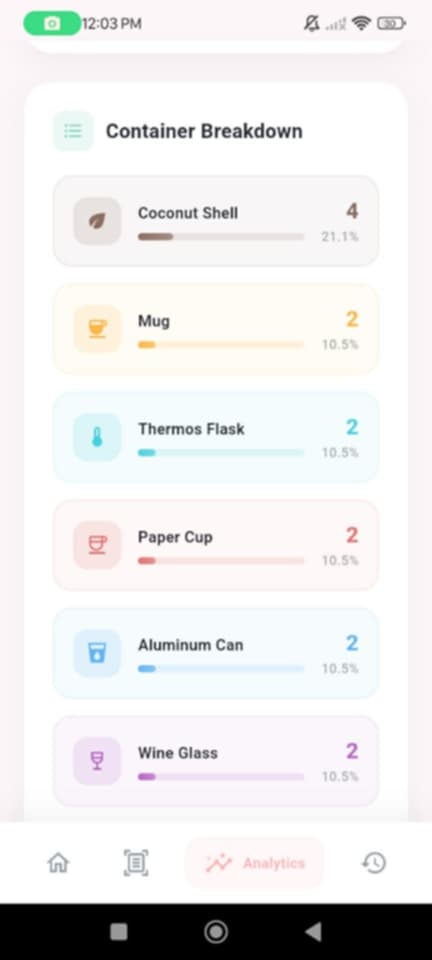

# Hi there 👋 I'm Roselle!

I'm a passionate developer who enjoys building clean and engaging applications for **web and mobile**.  
I love learning new technologies and improving my development skills every day through hands-on projects.

---

## 🚀 Featured Project  
# 🥤 Container Beverages Classification App

This project is a **Flutter-based mobile application** that identifies different **beverage containers** using **image classification**.  
It was developed as part of our **IT108 Final Project**, integrating **Teachable Machine** and **TensorFlow Lite**.

Users can **scan containers using the camera** or **upload images from the gallery** to automatically classify the container type.

---

## 🎯 Project Objectives
- 📸 Identify beverage containers using images  
- 🧠 Apply machine learning for accurate classification  
- 📊 Display analytics and scan history  
- 📱 Provide a clean and user-friendly mobile interface  

---

## 🥤 Beverage Container Classes

📁 **Image source:** `Container_Beverages_Class_Images/`

<table align="center">
<tr>
<td align="center"> <b>Mug</b></td>
<td align="center"> <b>Coconut Shell Cup</b></td>
<td align="center"> <b>Paper Cup</b></td>
</tr>

<tr>
<td align="center"> <b>Aluminum Can</b></td>
<td align="center"> <b>Plastic Bottle</b></td>
<td align="center"> <b>Glass Bottle</b></td>
</tr>

<tr>
<td align="center"> <b>Thermos Flask</b></td>
<td align="center"> <b>Tumbler</b></td>
<td align="center"> <b>Wine Glass</b></td>
</tr>

<tr>
<td align="center"> <b>Water Jug</b></td>
</tr>
</table>

---

## 📱 Application Features (WORKING IMAGES)

📁 **Image source:** `Application_Screenshot/`

<table align="center">
<tr>
<td align="center">
 
<b>Splash Screen</b> 
Initial loading screen displayed when the app starts.
</td>

<td align="center">
 
<b>Home Page</b> 
Main navigation screen of the application.
</td>
</tr>

<tr>
<td align="center">
 
<b>Scan Detection</b> 
Uses the camera to identify beverage containers.
</td>

<td align="center">
 
<b>Analytics</b> 
Displays graphs and statistics of classified containers.
</td>
</tr>

<tr>
<td align="center">
 
<b>Container Breakdown</b> 
Shows the distribution of detected container types.
</td>

<td align="center">
 
<b>History</b> 
Displays previously scanned containers.
</td>
</tr>
</table>

---

## 🧠 Technologies Used

### Mobile Development
- Flutter  
- Dart  

### Machine Learning
- Teachable Machine  
- TensorFlow Lite (`.tflite`)  
- `labels.txt`  

### Tools
- Git & GitHub  
- Android Emulator / Physical Device  

---

## 🗂️ Project Structure

---

## 📫 How to Reach Me
📧 **Email:** rosellepazo19@gmail.com  

---

## ✨ Fun Fact
I enjoy exploring new technologies and transforming ideas into real-world applications!

---

## 📊 GitHub Stats

