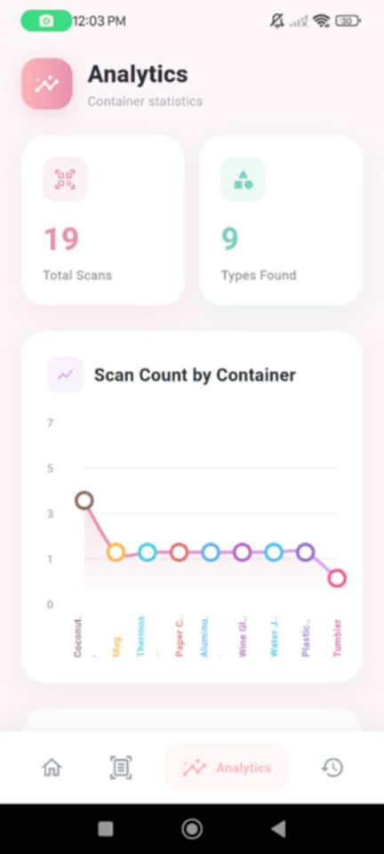
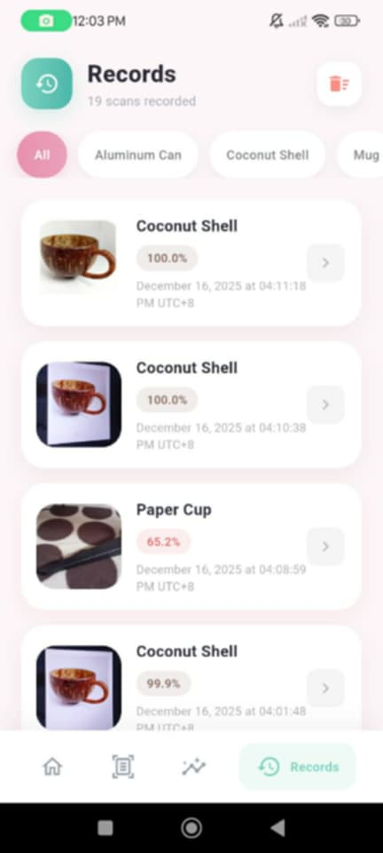

# Hi there 👋 I'm Roselle!

I'm a passionate developer who enjoys building clean and engaging applications for **web and mobile**.  
I love learning new technologies and improving my development skills every day through hands-on projects.

---

## 🚀 Featured Project  
# 🥤 Container Beverages Classification App

This project is a **Flutter-based mobile application** that identifies different **beverage containers** using **image classification**.  
It was developed as part of our **IT108 Final Project**, integrating **Teachable Machine** and **TensorFlow Lite**.

Users can **scan containers using the camera** or **upload images from the gallery** to automatically classify the container type.

---

## 🎯 Project Objectives
- 📸 Identify beverage containers using images  
- 🧠 Apply machine learning for accurate classification  
- 📊 Display analytics and scan history  
- 📱 Provide a clean and user-friendly mobile interface  

---

## 🥤 Beverage Container Classes

Below are the **10 supported container types**, with sample images from the dataset and short descriptions:

| Container | Image | Description |
|---------|-------|-------------|
| **Mug** |  | A sturdy cup with a handle, commonly used for hot beverages like coffee or tea. |
| **Coconut Shell Cup** |  | An eco-friendly cup made from coconut shells, often used for natural or traditional drinks. |
| **Paper Cup** |  | A disposable cup commonly used for takeaway beverages. |
| **Aluminum Can** |  | A lightweight metal container typically used for soft drinks and canned beverages. |
| **Plastic Bottle** |  | A common container for water, juice, and soft drinks made of plastic material. |
| **Glass Bottle** |  | A transparent bottle often used for soda, juice, or other beverages. |
| **Thermos Flask** |  | An insulated container designed to keep drinks hot or cold for long periods. |
| **Tumbler** |  | A reusable cup often used for both hot and cold beverages. |
| **Wine Glass** |  | A stemmed glass specifically designed for serving wine. |
| **Water Jug** |  | A large container used for storing and pouring water. |

---

## 📱 Application Features (with Screenshots)

| Feature | Screenshot | Description |
|-------|------------|-------------|
| **Home Screen** |  | The main dashboard that provides navigation to scanning, analytics, and history. |
| **Camera Scan** |  | Allows users to scan beverage containers using the device camera. |
| **Image Upload** |  | Enables users to upload images from the gallery for classification. |
| **Analytics** |  | Displays graphs and statistics of classified containers. |
| **Scan History** |  | Shows previously scanned containers for tracking and review. |

---

## 🧠 Technologies Used

### Mobile Development
- Flutter  
- Dart  

### Machine Learning
- Teachable Machine  
- TensorFlow Lite (`.tflite`)  
- `labels.txt`  

### Tools
- Git & GitHub  
- Android Emulator / Physical Device  

---

## 🗂️ Project Structure

---

## 🔧 Technologies I Use

---

## 📫 How to Reach Me

📧 **Email:** rosellepazo19@gmail.com  

---

## ✨ Fun Fact
I enjoy exploring new technologies and transforming ideas into **real-world applications**!

---

## 📊 GitHub Stats

